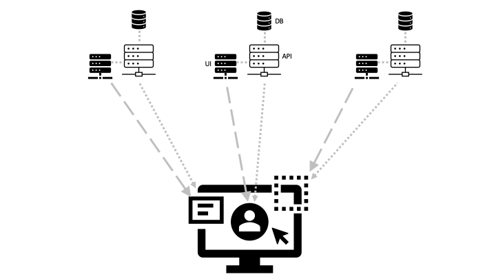
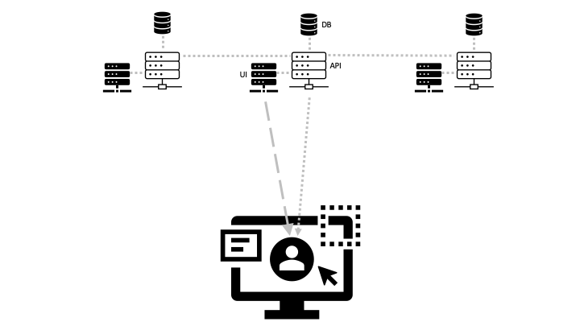

# Integration at the User Interface

Integrating at the user interface means increased reuse and presentation consistency as compared to integration via an API. It offers a way to reduce the complexity of what might otherwise be a monolithic UI application. Integration takes place in the browser instead of a backend server.

Integration in the browser involves surfacing UI artefacts from separate sources into a single application. Each remote UI component is responsible for its own API data concerns.

Integration via an API involves surfacing UI artefacts from a single application. That application would typically leverage other APIs via its own backend.

## UI Integration Techniques

UI integration can be achieved in the following ways:
1. Deep links directing the user to a different website - often in a new browser tab.
1. Deep links that load a different website into an embedded iframe.
1. Module Federation supporting the use of remote UI components in a common context - i.e. on the same page without iframes.

This project is an example of UI integration using Module Federation.

## Module Federation vs iframes

Integrating via an iframe:
* The consumer passes information to the provider via the http request that loads the iframe in the initial instance - usually a GET request but can be a POST if required.
* Once in the browser, the consumer can continue to communicate with the iframe by (i) using the window.postMessage function and event listeners (it even seems possible to do this cross-domain), or (ii) manipulating the iframe url fragment identifier - although this is a bit of a hack!
* The consumer receives information from the provider by (i) using the window.postMessage function as above,or (ii) reading the iframe document with JavaScript. The document is normally HTML since it is designed to be read by a human, but it is possible for the provider to respond with a machine-readable XML document and have the consumer application hide this XML document from the user.
* An iframe can be responsive to changes in the consumer browser window size with some css to maintain its aspect ratio, but sizing an iframe according to the needs of the provider content is more difficult. It can be achieved using JavaScript messaging as highlighted above - e.g. including resize options as part of the consumer / provider event interface.
* Any backend API requests initiated from within the iframe use the iframe document origin when applying cross-origin checks.

Integrating via Module Federation:
* Remote modules expose properties and callbacks in the same manner as local modules so there is effectively no difference to the consumer using a remote component or a local one.
* Remote module content becomes part of the consumer document and therefore responds to browser window size changes in the usual way without additional code.
* As part of the same document, remote content can be easily re-styled if required.
* Any backend API requests initiated from a remote module use the consuming document origin when applying cross-origin checks. This might require configuration changes to the backend API to accept requests from the consumer origin.

In summary, Module Federation supports a superior user experience with less UI code complexity, but potentially introduces new cross-origin sharing requirements.
